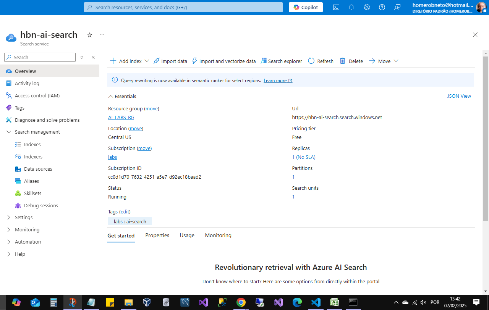
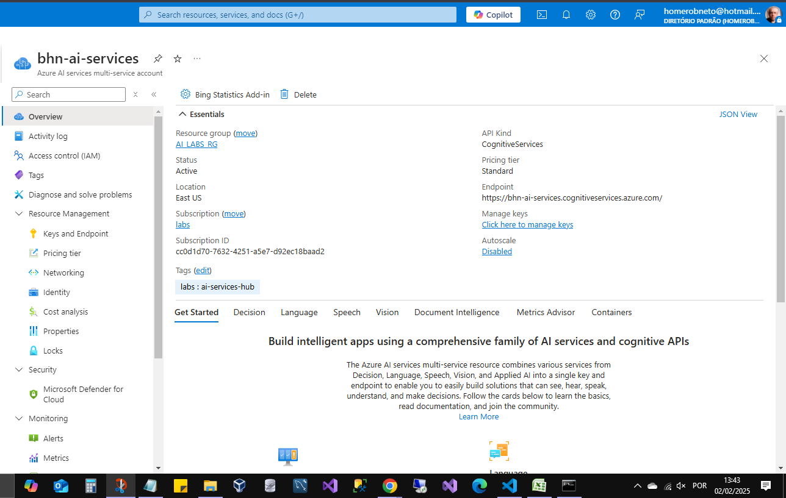
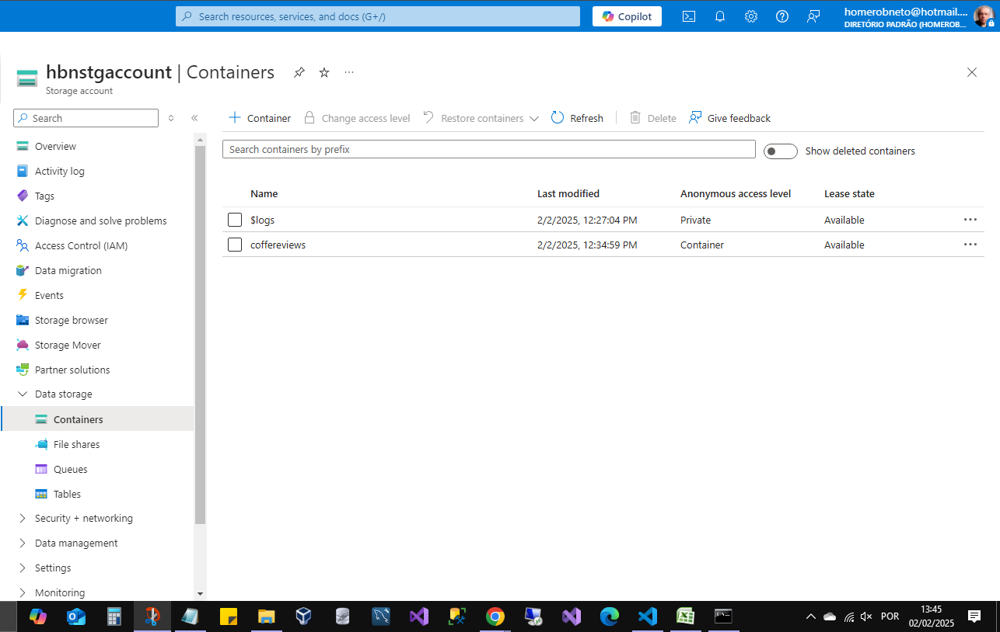
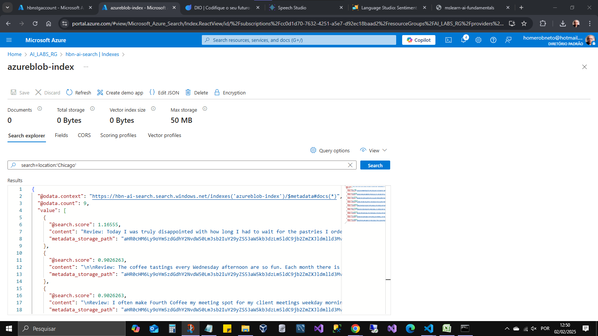

# Azure AI Search index

## Visão Geral

- Este laboratório demonstra como criar uma solução de mineração de conhecimento utilizando o Azure AI Search. Através da indexação de dados extraídos de avaliações de clientes, é possível facilitar a busca por insights sobre as experiências dos consumidores.

## Casos de uso:

- A busca indexada pode ser aplicada para analisar feedback dos seus consumidores, colaboradores, parceiros e assim permitir tomada de decisão mais agíl na identificação de tendências e áreas de melhoria em seus produtos ou serviços.

## Pré-requisitos

- Assinatura ativa do Microsoft Azure. [https://azure.microsoft.com](https://azure.microsoft.com).
- AI Search
  
- Azure AI Services
  
- Storage Account
  

## Etapas para Execução

- Baixar as amostras de reviews: [https://aka.ms/mslearn-coffee-reviews](https://aka.ms/mslearn-coffee-reviews)

- Descompactar o pacote das amostras: Extraia os arquivos para uma pasta local.
- Criar uma Conta de Armazenamento no Azure: No portal do Azure, crie uma nova Conta de Armazenamento no mesmo grupo de recursos e região dos seus recursos do Azure AI Search e Azure AI Services.
  Após a criação, vá até a conta de armazenamento, selecione "Containers" e crie um novo container chamado "coffeereviews" com acesso público definido como "Container (anonymous read access for containers and blobs)".
- Fazer upload das amostras para o container: No container "coffeereviews", clique em "Upload" e selecione todos os arquivos extraídos na etapa 2 para fazer o upload.
  Importar dados no Azure AI Search: No portal do Azure, acesse seu recurso do Azure AI Search e clique em "Import data" para iniciar o assistente de importação de dados.
- Selecione "Azure Blob Storage" como fonte de dados e configure-o para apontar para a conta de armazenamento e o container "coffeereviews" onde as amostras foram carregadas.
- Configure o indexador e o índice conforme necessário para processar e indexar os dados.
- Indexar os dados:Execute o indexador para extrair e indexar os dados das avaliações dos clientes.
- Utilizar o painel para realizar consultas: Após a indexação, utilize o painel de consulta do Azure AI Search para executar buscas e analisar os insights derivados das avaliações dos clientes.

